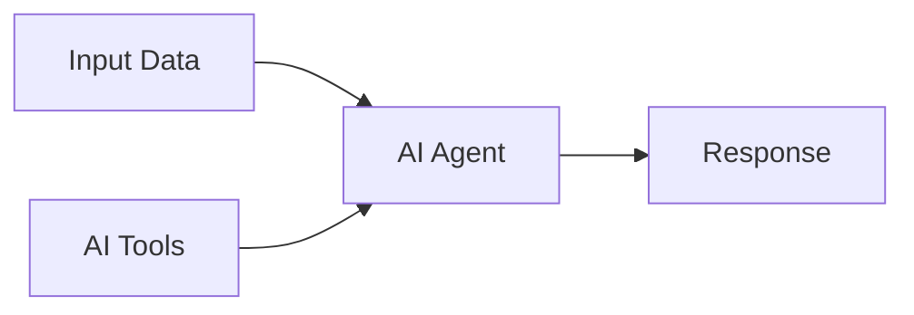

# AI Agent

The AI Agent node enables you to integrate large language models into your workflows for intelligent automation, content generation, and decision-making.

## Overview

AI Agents in Orchka are powered by **LangChain**, providing access to multiple AI providers and the ability to use tools for complex tasks.



## Configuration

### Model Selection

Choose from supported AI providers:

| Provider | Models | Credential Type |
|----------|--------|-----------------|
| OpenAI | GPT-4.1, GPT-4o, o1, o3 | OpenAI |
| Anthropic | Claude Sonnet 4, Claude 3.7, Claude 3.5 Haiku | Anthropic |
| Google | Gemini 2.5, Gemini 2.0, Gemini 1.5 | Google AI |
| Groq | Llama 3.3, Mixtral, Gemma 2 | Environment variable |

### Authentication

You can authenticate with AI providers in two ways:

**Option 1: Stored Credentials (Recommended)**

1. Create a credential in the **Credentials** page
2. Select the credential in the AI Agent node settings
3. The credential type must match the model provider

```yaml
Model: gpt-4o
Credential: My OpenAI Key
```

**Option 2: Environment Variables**

Set the appropriate environment variable:
- `OPENAI_API_KEY` for OpenAI models
- `ANTHROPIC_API_KEY` for Anthropic models
- `GOOGLE_GENERATIVE_AI_API_KEY` for Google models
- `GROQ_API_KEY` for Groq models

### System Prompt

Define the AI agent's behavior and personality:

```
You are a helpful assistant that analyzes customer feedback and extracts key insights.
Always respond in JSON format with the following structure:
{
  "sentiment": "positive" | "negative" | "neutral",
  "topics": ["array", "of", "topics"],
  "summary": "brief summary"
}
```

### Input Message

The user message sent to the AI, typically using expressions:

```
Analyze this customer review: {{ $input.reviewText }}
```

## Using AI Tools

AI Agents can use connected **AI Tool** nodes to perform actions. This enables:

- Fetching external data
- Making calculations
- Calling APIs
- Database lookups

### Connecting Tools

1. Create an **AI Tool** node on the canvas
2. Connect it to the AI Agent's **tools handle** (bottom)
3. Configure the tool's name, description, and parameters

### Tool Configuration Example

**Tool: Weather Lookup**

```yaml
Name: get_weather
Description: Get current weather for a location
Parameters:
  type: object
  properties:
    location:
      type: string
      description: City name or coordinates
  required:
    - location
```

The AI will automatically call this tool when it needs weather information.

## Response Handling

### Structured Output

To get structured JSON responses:

1. Include format instructions in the system prompt
2. Use json parsing in subsequent nodes:

```
{{ $parse($input.response) }}
```

### Streaming (Coming Soon)

Real-time streaming of AI responses for long-form content generation.

## Best Practices

### 1. Clear Instructions

Be specific in your system prompt:

```
❌ "Summarize the text"
✅ "Summarize the following text in exactly 3 bullet points, each under 20 words"
```

### 2. Handle Errors

Add a Condition node after AI Agent to handle failures:

```
{{ $exists($input.error) }}
```

### 3. Cost Optimization

- Use GPT-3.5 for simple tasks
- Reserve GPT-4 for complex reasoning
- Set appropriate `max_tokens` limits

### 4. Temperature Settings

| Temperature | Use Case |
|-------------|----------|
| 0.0 - 0.3 | Factual, deterministic tasks |
| 0.4 - 0.7 | Balanced creativity |
| 0.8 - 1.0 | Creative, varied outputs |

## Example Workflows

### Customer Support Triage

```
[Email Webhook] → [AI Agent] → [Condition] → [Route to Team]
                      ↑
              [Priority Classifier Tool]
```

### Content Generation Pipeline

```
[Topic Input] → [AI Agent: Research] → [AI Agent: Write] → [AI Agent: Edit] → [Output]
```

### Data Extraction

```
[File Upload] → [Parse PDF] → [AI Agent: Extract Fields] → [Save to Database]
```

## Troubleshooting

### Common Issues

**"API key not configured"**
- Create a credential in the Credentials page and select it in the node
- Or ensure the correct environment variable is set
- Restart the server after adding environment variables

**"Credential type mismatch"**
- The credential type must match the model provider
- OpenAI models require OpenAI credentials
- Claude models require Anthropic credentials

**"Rate limit exceeded"**
- Add Wait nodes between AI calls
- Implement retry logic with exponential backoff

**"Response truncated"**
- Increase `max_tokens` setting
- Break complex tasks into smaller prompts

<Cards>
  <Card title="Credentials" href="/docs/credentials">
    Learn about secure credential management.
  </Card>
  <Card title="Expressions" href="/docs/expressions">
    Pass dynamic data to AI prompts.
  </Card>
  <Card title="Node Types" href="/docs/nodes">
    Back to all node types.
  </Card>
</Cards>
